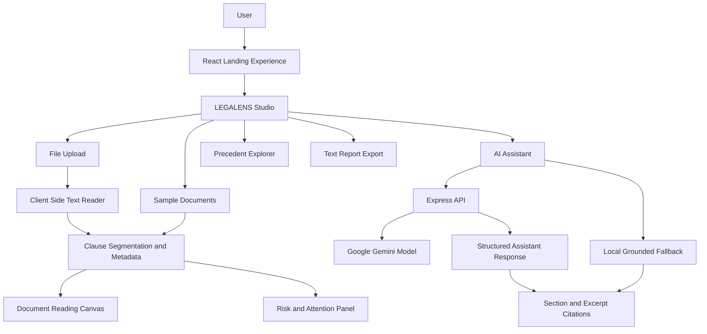
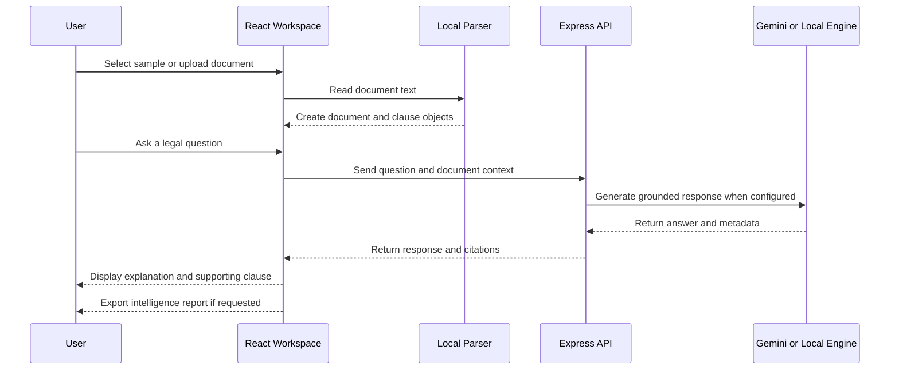

# LEGALENS — AI-Powered Legal Document Intelligence

<div align="center">

# ⚖️ LEGALENS

**Read the fine print. Understand the risk. Decide with clarity.**

An editorial-style legal document intelligence interface that turns contracts into searchable clauses, plain-language explanations, grounded answers, risk signals, and downloadable intelligence reports.

[](https://react.dev/)
[](https://www.typescriptlang.org/)
[](https://vitejs.dev/)
[](https://tailwindcss.com/)
[](https://ai.google.dev/)
[](LICENSE)

[🌐 Live Website](https://legallens.ai/) · [🚀 GitHub Pages](https://ankitkumar06102005.github.io/legallens/) · [⚡ Quickstart](#quickstart)

</div>

---

## 🧭 What is LEGALENS?

LEGALENS is a client-focused legal document exploration platform for people who need to understand agreements without reading every clause in isolation.

The application combines a polished React interface with a document workspace, local clause extraction, a grounded assistant, optional Gemini-powered responses, precedent discovery, and text-report export.

Typical use cases include:

- Residential leases and rental agreements
- Employment and service agreements
- NDAs and confidentiality documents
- Software and business contracts
- General uploaded TXT, Markdown, and text-readable documents

> **Important:** LEGALENS is an informational document-intelligence tool, not a substitute for advice from a qualified legal professional.

---

## ✨ Core Capabilities

### 📑 Document Intelligence Workspace

The `LEGALENS Studio` workspace provides:

- Sample contract selection
- User document upload
- Full-text reading canvas
- Clause navigation pills
- Text filtering
- Clause-by-clause explanations
- Risk and attention indicators

### 🤖 Grounded Legal Assistant

The assistant supports two execution paths:

1. **Backend-assisted path** — sends the question and document context to `POST /api/chat`.
2. **Local fallback path** — performs keyword-based clause matching and generates a response from the active document when the API is unavailable.

Assistant responses can include:

- Plain-language explanations
- Section references
- Clause excerpts
- Attention notes
- The engine used for the response

### ⚠️ Clause Risk Signals

Clauses are organized with metadata such as:

- Category
- Section number
- Page reference
- Attention level
- Parties affected
- Plain-language explanation
- Practical implication

### 🏛️ Case-Law & Precedent Exploration

The interface includes a precedent discovery section backed by structured precedent data, allowing users to explore legal concepts and related judicial references presented by the application.

### 📥 Intelligence Report Export

The workspace can generate a downloadable text report containing:

- Document metadata
- Executive summary
- Extracted clauses
- Categories and attention levels
- Page references
- Excerpts
- Explanations and implications
- Full document text

---

## 🏗️ Architecture



### Application flow



---

## 🧰 Tech Stack

| Layer | Technologies |
|---|---|
| Frontend | React 19, TypeScript, Vite 8 |
| Styling | Tailwind CSS v4, Google Fonts |
| UI and Motion | Lucide React, Motion |
| Server | Node.js, Express, Vite middleware |
| AI | Google Gen AI SDK, Gemini 2.5 Flash |
| Document handling | Browser FileReader, local text segmentation |
| Deployment | GitHub Pages, Vercel-compatible build, Node server |

---

## 🗂️ Project Structure

```text
legallens/
├── .github/workflows/       # Deployment workflow
├── public/                  # Public assets and CNAME
├── samples/                 # Sample contract documents
├── src/
│   ├── components/
│   │   ├── WorkspaceModal.tsx
│   │   ├── AiAssistantSection.tsx
│   │   ├── DocumentAnalysisSection.tsx
│   │   ├── RagPipelineSection.tsx
│   │   ├── CaseLawSection.tsx
│   │   ├── AnnotatedPdfSection.tsx
│   │   └── ...
│   ├── data/
│   │   ├── sampleDocuments.ts
│   │   ├── casePrecedents.ts
│   │   └── ragPipeline.ts
│   ├── services/
│   │   └── aiAssistantService.ts
│   ├── App.tsx
│   └── ...
├── server.ts
├── package.json
└── README.md
```

---

## 📡 API Reference

The Express server exposes the following documented application routes.

### Health check

```http
GET /api/health
```

Returns service status and runtime configuration information.

### Legal assistant

```http
POST /api/chat
Content-Type: application/json
```

Example request:

```json
{
  "message": "What are the termination conditions?",
  "docId": "residential-lease",
  "docTitle": "Residential Lease Agreement",
  "docContext": "Full document text supplied by the workspace"
}
```

The frontend expects an assistant response containing a text answer and may also consume:

```json
{
  "id": "message-id",
  "sender": "assistant",
  "timestamp": "04:34 pm",
  "text": "Plain-language explanation",
  "citations": [],
  "attentionNote": "Optional caution message",
  "engine": "model-or-fallback-identifier"
}
```

### Contract analysis

```http
POST /api/analyze
Content-Type: application/json
```

This route is part of the application's analysis surface and is intended for document-level analysis and clause/risk output.

---

## ⚡ Quickstart

### Prerequisites

- Node.js 18+ recommended
- npm or pnpm
- Optional Gemini API key for model-assisted responses

### 1. Clone the repository

```bash
git clone https://github.com/Ankitkumar06102005/legallens.git
cd legallens
```

### 2. Install dependencies

```bash
npm install
```

### 3. Configure environment variables

Create a `.env` file if you want to enable Gemini-backed responses:

```env
GEMINI_API_KEY=your_gemini_api_key
```

Use `.env.example` as the starting point when available. Never commit real API keys.

### 4. Start the development server

```bash
npm run dev
```

Open:

```text
http://localhost:3000
```

### 5. Run type checking

```bash
npm run lint
```

### 6. Build the production bundle

```bash
npm run build
```

### 7. Start the Express server

```bash
npm start
```

---

## 🚀 Deployment

### GitHub Pages

The repository includes a deployment workflow and a custom domain configuration for:

- https://legallens.ai/
- https://ankitkumar06102005.github.io/legallens/

Build manually with:

```bash
npm run deploy
```

### Other platforms

The project can also be built with:

```bash
npm run build
```

For a Node-based deployment, start the server with:

```bash
npm start
```

---

## 🔐 Privacy and Data Handling

The current workspace performs document reading and basic clause extraction in the browser. When the assistant API is used, the frontend sends the question and document context to the configured backend route.

Do not upload confidential or personally sensitive legal documents unless you understand the deployment, logging, and model-provider configuration of the environment you are using.

---

## ⚖️ Legal Disclaimer

LEGALENS provides educational and informational document insights only. It does not provide legal advice, establish an attorney-client relationship, or replace a licensed attorney. Seek qualified legal counsel for decisions involving legal rights, obligations, disputes, or signatures.

---

## 📄 License

Licensed under the [Apache License 2.0](LICENSE).

---

<div align="center">

**LEGALENS — Making complex agreements easier to understand.**

</div>
